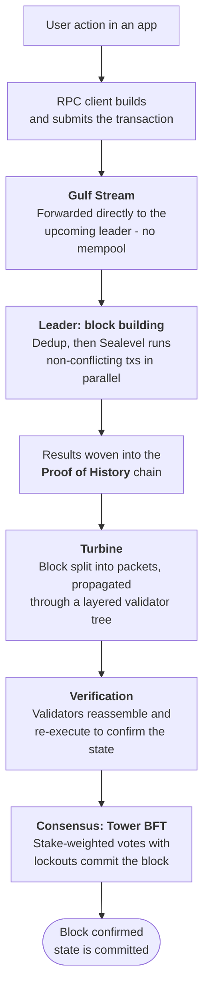
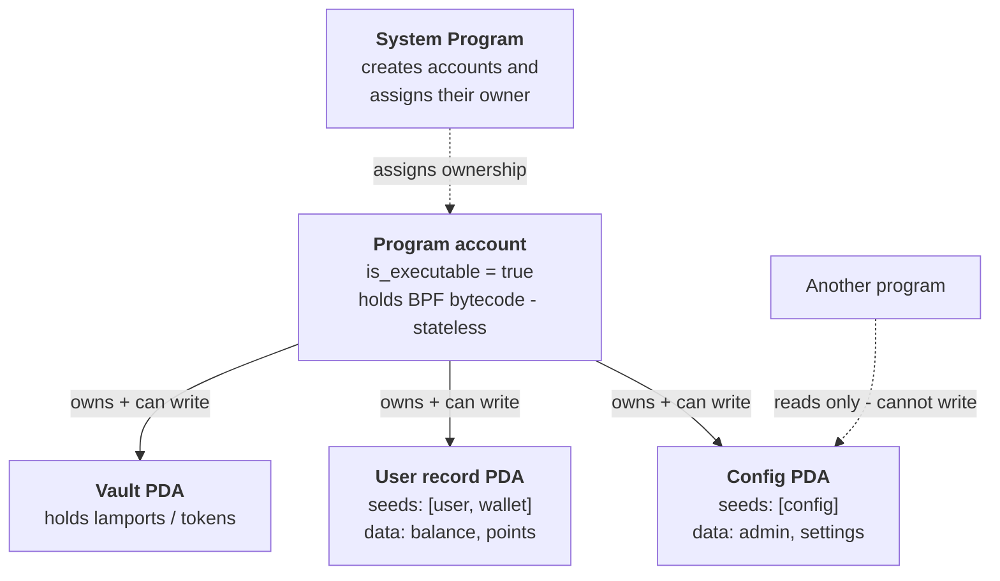

# Module 1: Solana Overview

## Learning Objectives

- Articulate why Solana has emerged as the leading platform for enterprise and financial infrastructure
- Describe Solana's core architecture, including Proof of History, Gulf Stream, Turbine, and Tower BFT
- Identify the key differences between Solana's programming model and EVM-based chains
- Explain the Solana account model, including accounts, programs, rent, and Program Derived Addresses
- Trace the lifecycle of a transaction from client to on-chain execution
- Understand Solana's fee model, including base fees, priority fees, and compute units

## Topics Covered

- Why Solana: market position, developer growth, and enterprise adoption
- Solana architecture and consensus
- Key differences from EVM-based chains
- The Solana data model
- Transactions, instructions, and programs
- Program Derived Addresses (PDAs)
- Compute units and the fee model

## Slides

[Solana Overview slides](https://docs.google.com/presentation/d/1C4mEhjs83HvIVG_VeXH30I4m5h2hGK9vjOiKWf63TSM/edit?usp=sharing)

---

## 1. Why Solana

Solana has established itself as the leading Layer 1 blockchain for startups and enterprises across every key metric: developer growth, application revenue, new asset creation, and trading volume.

Solana is trusted by major stablecoin issuers including Societe Generale, PayPal, Paxos, and Siam Commercial Bank, and has received regulatory approvals from the NY Department of Financial Services (NYDFS) and the Thailand Digital Asset Regulatory Sandbox.

Financial services firms such as Visa, Stripe, and PayPal have chosen Solana for payments and commerce infrastructure, leveraging stablecoin settlement and merchant payment flows built on USDC and PYUSD.

## 2. Understanding Solana

Solana's core insight is a fundamentally different approach to transaction ordering and execution.

Traditional blockchains like Ethereum process transactions sequentially - each must complete before the next begins. This creates a bottleneck: approximately 15 TPS, 12-second block times, and unpredictable fees.

Solana separates ordering from execution. Proof of History (PoH) creates a cryptographic clock that proves the ordering of events mathematically, eliminating the need for validators to negotiate sequence. This enables parallel execution of non-conflicting transactions across multiple cores.

**The result:** ~3,000+ TPS, 400ms block times, and fees below $0.001.

## 3. Solana Architecture

Solana's architecture is composed of several interconnected components that work together to achieve high throughput and fast finality.

**Gulf Stream - Transaction Forwarding.** Before a validator becomes leader, other validators and clients already know it is coming thanks to the pre-computed leader schedule. They forward transactions directly to the upcoming leader's memory. By the time the slot starts, the leader has a warm queue ready to execute immediately. There is no idle mempool.

**Block Building - Leader Execution.** The leader takes queued transactions, deduplicates them, and runs them through Sealevel in parallel. As it executes, it weaves the results into the PoH chain - each transaction receives a PoH tick, creating a cryptographic record of ordering and time.

**Turbine - Block Propagation.** The leader cannot send the full block to all validators at once. Turbine breaks the block into small packets and propagates them through a layered tree of validators. Each validator receives its chunk and forwards pieces to a small neighborhood below it - inspired by BitTorrent.

**Block Verification.** Each validator reassembles the block from Turbine chunks, re-executes the transactions independently, and checks that the resulting state matches what the leader claimed. If anything does not match, the block is rejected.

**Consensus - Tower BFT.** Solana uses Tower BFT, a PoH-aware variant of PBFT. Validators cast votes on blocks by locking their stake behind them. The longer a validator has been voting on a particular fork, the longer its lockout period before it can switch. This makes it economically irrational to flip to a different fork late in the process.

### Transaction Lifecycle

This diagram traces a single transaction through the components above - from the user's action in an application all the way to a committed block. It is the same path section 8 summarizes from the client's point of view, shown here end to end.



## 4. Key Differences from EVM

Understanding the differences between Solana and EVM-based chains is essential for developers transitioning from Ethereum or evaluating Solana for enterprise use.

**Smart Contract Model.** Ethereum's EVM runs one contract at a time in a sandboxed environment. Solana's runtime, Sealevel, executes thousands of smart contracts in parallel by analyzing which accounts each transaction touches and running non-overlapping ones simultaneously.

**State Model.** Ethereum stores state inside smart contracts - the contract owns its storage. Solana separates programs (code) from accounts (data). Programs are stateless; data lives in separate accounts. This makes programs more composable and parallelizable.

**No Re-Entrancy.** On Ethereum, re-entrancy is a runtime problem that developers must guard against (as demonstrated by the 2016 DAO hack). On Solana, the runtime enforces a hard rule: a program cannot be re-entered while it is already in the call stack. This entire class of vulnerability is structurally prevented at the protocol level.

**Parallel Execution.** Solana transactions declare which accounts they will read or write upfront. The runtime uses this to execute non-conflicting transactions simultaneously across multiple cores.

**No Mempool.** Gulf Stream forwards transactions directly to the next expected leader. There is no global mempool.

**Upgradability.** Solana programs are upgradable by default, allowing teams to iterate on deployed programs.

**Fee Model.** Solana uses a base fee per signature (5,000 lamports) plus an optional priority fee, rather than Ethereum's global gas auction.

| Aspect | Ethereum (EVM) | Solana (SVM) |
|--------|----------------|--------------|
| Contract Model | Stateful - contract + state combined | Stateless - program and state separated |
| Execution | Single-threaded | Multi-threaded, parallel |
| Re-Entrancy | Possible - developer must guard against it | Structurally prevented by the runtime |
| Transaction Forwarding | Global mempool | Gulf Stream - direct forwarding to leader |
| Upgradability | Immutable by default (proxy patterns required) | Upgradable by default |
| Fee Model | Global gas auction | Base fee + optional priority fee |

## 5. Accounts

Everything on Solana is an Account. An account is a slice of data stored on the blockchain, uniquely identified by its address. This can be compared to Unix file systems, where everything is a file accessed by its index.

When an account is created, a certain amount of space is allocated and rent must be paid based on that space. The space is dynamic - if additional space is needed, it can be allocated with a corresponding rent increase.

Accounts can only be created by the System Program. After creation, the System Program can transfer ownership of an account to another program.

**Account Structure:**

```json
{
  "key": "PublicKey",
  "lamports": "number",
  "data": "Uint8Array",
  "is_executable": "boolean",
  "owner": "PublicKey"
}
```

**Account Flags:**
- **Writable** - Serial access (one at a time). Required when the account's state will be modified.
- **Read Only** - Parallel access (many at once). Used when the account's data is only being read.
- **Signer** - The account has signed the transaction.
- **Executable** - The account is a program.

## 6. Programs

Programs are a special type of account with the executable flag set to `true`. They are stateless - they do not store data themselves but interact with other accounts on the blockchain to read and write data.

A program can own non-executable accounts. For example, a program that tracks user points would create accounts to store that data, and those accounts would be owned by the program. A program must be the owner of an account in order to modify its state; otherwise, it can only read data.

Programs are managed by the BPF Loader. The latest version is the Upgradeable BPF Loader, which allows programs to be updated after deployment.

**Native Programs** (such as the System Program and SPL Token Program) are provided by Solana. **User Programs** are written and deployed by developers.

### Program and Account Ownership

This is the separation that most surprises EVM developers: the program (code) and its state (data) live in *different* accounts. A program is stateless bytecode; every piece of mutable state sits in a separate account that the program owns. A program can write only to accounts it owns, and it can sign for the PDAs it derived. Everyone else gets read-only access.



## 7. Rent

"Rent" is the deposit an account holds to cover the cost of storing its data on-chain. When an account is created, this deposit is set based on the amount of space allocated.

- **Rent must be paid to create an account** — based on the space it allocates
- **Pay 2 years' worth upfront** to make the account **rent-exempt**
- **All new accounts must be rent-exempt** — this is required at account creation
- **Closing** an account lets the full deposit be reclaimed
- **Resizing** an account costs or returns the difference
- **Upgradable programs** allocate **double the size of the program bytecode** in their ProgramData account, leaving headroom for future upgrades — so the deposit is sized for that larger allocation

> [!IMPORTANT]
> **"Rent" is a refundable deposit, not a fee — you are never actually charged this amount.** The lamports sit in the account's own balance and are returned in full when the account is closed. The "2 years" figure is only how the rent-exempt threshold is *calculated*; it is not a recurring cost. The legacy mechanism that once periodically collected rent from non-exempt accounts has been retired, so today every account is simply rent-exempt from creation and never debited.

## 8. Transactions

Transactions are the mechanism for calling methods on Solana programs. They are submitted through an RPC provider and must include all accounts that the transaction will reference.

A transaction is made up of one or more **instructions**. Instructions are the interface to Solana programs - each targets a specific program ID and a specific method. Transactions are **atomic**: if any instruction fails, the entire transaction is reverted and no state change occurs (transaction fees are still charged).

EVM has no native transaction-level batching (a transaction hits one entry point) so you either route through an aggregator/multicall contract (mostly reads) or use account abstraction (4337 bundlers / 7702) for user-authenticated writes.

**Transaction Structure:**

```json
{
  "message": {
    "instructions": "Array<Instruction>",
    "recent_blockhash": "number",
    "fee_payer": "PublicKey"
  },
  "signers": "Array<Uint8Array>"
}
```

**Lifecycle of a Transaction:**

1. A user performs an action and a transaction is sent to the RPC client
2. The RPC client routes the transaction to a validator
3. The validator executes the instruction(s) targeting the specified program(s)
4. The program modifies the state of the referenced accounts

## 9. Program Derived Addresses (PDAs)

Program Derived Addresses are one of the most important concepts on Solana. A PDA is an address made up of **seeds** and a **bump** that has no corresponding private key.

Solana uses the ed25519 elliptic curve for key generation. A PDA is an address that falls off this curve, meaning no matching private key exists. This has a powerful consequence: since PDAs have no private key, the program that derived the PDA can **sign on behalf of that account** using the seeds and bump. No other program can sign on behalf of that PDA, because the deriving program's ID is checked during signing.

**Key Properties:**
- Made up of seeds and a bump
- Deterministic if seeds are chosen well (e.g., using a user's wallet key as a seed)
- Can be used as a hashmap (key/value store)
- Cannot collide with PDAs or accounts created by other programs
- Programs can sign on behalf of PDAs they own

**Associated Token Accounts** are a well-known example of PDAs in practice - the ATA address is deterministically derived from the owner's wallet, the token program, and the mint address.

## 10. Compute Units

All on-chain actions require compute units (CUs). Compute units measure the computational resources that a transaction consumes on the network.

| Limit | Value |
|-------|-------|
| Base fee per signature | 5,000 lamports |
| Default CU limit per instruction | 200,000 |
| Built-in instruction default CU | 3,000 |
| Max CU limit per transaction | 1,400,000 |

You can request additional compute units (up to 1.4 million per transaction), but this is generally not advised unless absolutely necessary. Because there is a limit of compute units per block, transactions with large compute unit requests may have a lower chance of being included in a block.

## 11. Fee Model

Solana's fee model differs significantly from Ethereum's global gas auction. On Solana, fees are structured as a local market:

- **Base fee:** 5,000 lamports per signature. This is a fixed cost.
- **Priority fee:** Lamports multiplied by compute units (optional). This functions as a tip to the leader validator.
- **Rent:** A deposit to keep an account alive on-chain. Refundable when the account is closed.

---

## Quiz

### Question 1 — Where State Lives

If programs are stateless, where does your program state live?

<details>
<summary>Answer</summary>

In separate **accounts that the program owns**. Solana separates code from state: the
program's executable bytecode sits in its (executable) program account, but everything
mutable — balances, config, user records — lives in the `data` field of *other* accounts.
A program can only write to accounts it owns. Program-controlled state is typically held in
**PDAs** (deterministically derived, no external keypair); user-owned state lives in
accounts the user created and assigned to the program. Lamports deposited for
rent-exemption keep those accounts alive.

</details>

### Question 2 — Parallel Execution

Two transactions arrive at the leader trying to send SOL but from different senders to
different receivers. How will they be executed?

<details>
<summary>Answer</summary>

**In parallel.** The two transactions write-lock disjoint account sets — sender₁/receiver₁
vs sender₂/receiver₂, all four distinct — so they don't conflict, and Solana's runtime
(Sealevel) schedules non-overlapping transactions across threads concurrently. Parallelism
is determined entirely by *write-lock* overlap: had they shared a writable account (the same
sender, or a common receiver), they'd be serialized instead. Read-only accounts can be
shared by many transactions without forcing serialization.

</details>

### Question 3 — PDA Signing

A PDA has no private key. So how can a program sign on its behalf?

<details>
<summary>Answer</summary>

Via **`invoke_signed`**, not a keypair. A PDA is deliberately derived to fall *off* the
ed25519 curve, so no private key exists for it. When a program makes a CPI, it passes the
PDA's seeds + bump as `signer_seeds`. The runtime re-derives the address from those seeds
and the **calling program's ID**; if it matches the account being used as a signer, the
runtime grants the signature. So the "signature" is authority bound to the program ID — only
the program whose ID produces that PDA can sign for it — not a cryptographic signature.

</details>

### Question 4 — PDA Namespacing

You deploy a program that creates a PDA seeded by `[b"vault", user.key()]`. Another
developer deploys a different program and tries to derive the same PDA with the same seeds.
Do they collide?

<details>
<summary>Answer</summary>

**No.** The program ID is part of the derivation input
(`find_program_address(seeds, program_id)`), so identical seeds under two different program
IDs produce two different addresses — each program gets its own PDA namespace. Even if the
other developer *hardcodes* your program's ID to derive the same address, they still can't
sign for it: `invoke_signed` checks the *calling* program's ID, so only your program can
produce that signature, and the account is owned by whoever created it. Same seeds,
different program → no collision in any meaningful sense.

</details>

### Question 5 — Transaction Atomicity

You write a transaction with three instructions: A, B, C. Instruction B fails. What happens
to A and C? What happens to the base fee paid?

<details>
<summary>Answer</summary>

Solana transactions are **atomic**, so the whole thing fails as a unit: B's failure aborts
execution, **C never runs**, and **A's effects are rolled back** — net zero state change.
But the **fee payer is still charged**. A transaction that fails *during execution* (as
opposed to being rejected pre-flight for an invalid blockhash, bad signature, or unfunded
fee payer) is still included in a block and still pays the base fee (5,000 lamports per
signature) plus any priority fee, because it consumed validator resources. Failed ≠ free.

</details>

## Additional Resources

- [Solana Documentation](https://solana.com/docs)
- [Solana Developer Guides](https://solana.com/developers/guides)
- [Solana Architecture Overview](https://solana.com/docs/intro/overview)
- [Solana Developer Report](https://www.developerreport.com/developer-report)
